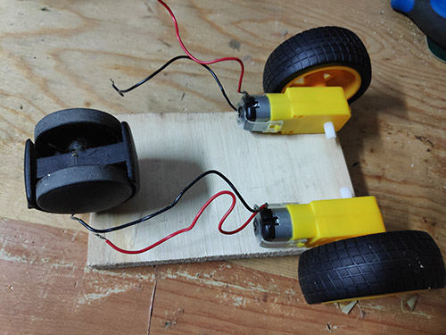
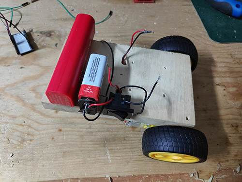
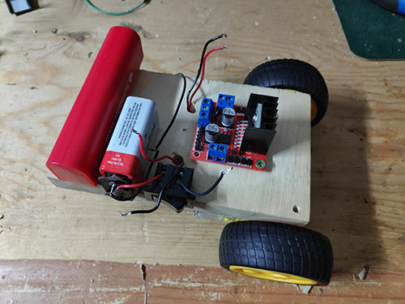
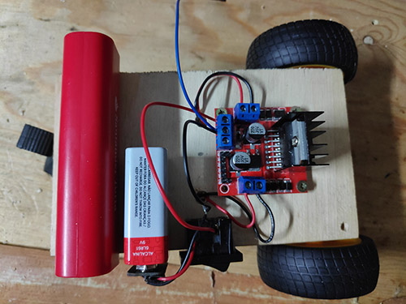
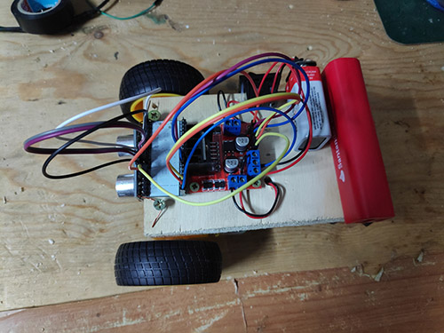

# Esp32_Car
### Just an esp32 controlled car with distance detection. 
#### This instuction will help you build your own WiFi controlled car.

## Prerequisites
For this project you will need:

- Arduino installed
    + [Arduino Download](https://www.arduino.cc/en/Main/Software)
- Setup Arduino for Esp32 Dev Board
    + [espressif/arduino-esp33](https://github.com/espressif/arduino-esp32)
- Setup the Blynk app
    + [Blynk download](https://play.google.com/store/apps/details?id=cc.blynk&hl=en_US)

## Parts Required

- Esp32 Dev Board
    + [Ebay-esp32](https://www.ebay.com/itm/ESP-32-ESP32S-Development-Board-2-4GHz-WiFi-Bluetooth-Antenna-CP2102-Module/152479854433?_trkparms=ispr%3D1&hash=item238081ef61:g:zIkAAOSwOUJbh47D&enc=AQADAAAB0KX%2FKt4E1xf3SDqEdBclaYZMetqRC9%2FhnE8htKYrZ97IC6%2B8u6fuurhYzjNJQLezVF52OAhNVoLWBLBKTFu%2B75yclemQ0fnEFxU2YIHbgzLEbG1s6zYhiSTXxltQ%2FyskUwm9gOUvl4SuxVunDYtndajS%2BK9gCEHRJPKQOBWB57s4JxL3ebWwD7cJ1zK3EVFP6AY7GR0bT%2FptlYR5%2BIXbY88rS4nDJxwptThR17L%2FASdIp6BkRIOec5yRUO2geuNhCjnU7h8S2FQM%2FKNeNxC7CFRJTTrOdhpz1Y%2F1ZSutvQie5UVs%2FeLDR0dc3WfD8dzHFVxCbfGYIUK3J9Gl299uhrvw3Ln4HiGAMvVub0QO%2FeSKPniOxwYUlKEDOM8ie2fww4P6yn9QRqgaLF%2FBrQC4EhnFWAB4yrAEpve%2FvjHVHy24KdtiLNThkMKOlHuYfvbZz3iHY7ECIEx5mL7rIXfwpDdwHah8pfmVddpDONwcXq4s38CpkDC%2BN7TYlZKUOyQ%2B0xP8vwQCYtI0SC2ehb1PIIrwsMBQdpGqeYf63s2TiGjhBtSJeYWqAq8UoyCP57m53UOq355bGIJgByRxlp5%2FGjTGzg0MD10u2e4rScnXM25F&checksum=152479854433828d11148cff4331b03eab4e0b251629)
- HC-SR04 Ultrasonic Module
    + [Ebay-HC-SR04](https://www.ebay.com/itm/Ultrasonic-Module-HC-SR04-Distance-Sensor-Measuring-Transducer-For-Arduino/283300575551?epid=7021169719&_trkparms=ispr%3D1&hash=item41f607b93f:g:IbkAAOSwaPpcEMLH&enc=AQADAAAB4KX%2FKt4E1xf3SDqEdBclaYZHAO1mRO5aUxZ2HgsvuasfwbjHiRv%2BJVODmMr7pLcQlrbtjc9ne1dtt1KA%2B9KjsgaDfpsW4xVcXO%2FjSzzIne%2FZybcOV3HslNF6vqnV9JjCnGMJTtPhzYcA8KkKNcR30sw%2F9Kd4WSGAhh%2B36Sas9U6ygpoE3a3%2BS%2F7fS1E%2Bv1LvYmOtfN2UvMq%2BnaxH6SpiAZX%2Bcg8u4fKo%2BxVbDEV5u7OUDhv%2FiYwnm%2F%2FMEfk9Kk65l0UYcSnlbHxay29KBNGmL7TugWpIhVBAOhG2sgMhZx5GEfxAeQBpEMxV7KFC772bra1HXEvTpc7m4V%2F6uwMbpTpU7rSGYfKWDO%2Bi8lU3lBQr0Xxe%2FbDDCfaTYQSPtAtldvEddxoxiTVPylgK4%2FPOIGrkrj4hysVnbf59R7V9%2FAod5YFjmfbVW54jXexD%2FiCsD3UrcEQoajwEeCMlCUa8uEkidX%2Bdd5TeYHSMA2qkHKyZe%2FSU%2BfEqdXL4q5xYZUjaVtHs7veTzxEg%2BTaAEbh58syZxLxsC4HKMKR%2BQxJ5ajsiPiiqtRqBDNWlPFy0kE%2FhWoovE%2FFFxheQTiNzL2dQyLiigy7gD38y5jHVgk3qx4%2Bol1QgVwe%2Fglunb%2Fr3mXQySw%3D%3D&checksum=2833005755513b70db3d58a446dfaddc64345c8787fe)
- 2 DC 3-6V Gear Motor, with 2 Tire Wheels
    + [Ebay-DC Gear Motor](https://www.ebay.com/itm/DC-3-6V-Gear-Motor-For-Arduino-Robot-with-Smart-Car-Robot-Plastic-Tire-Wheel/264022644177?hash=item3d78f9d5d1:m:mc5x-R5C1med_S7Md4WDdiQ)
- 1 L298N DC Stepper Motor Driver
    + [Ebay-L298N](https://www.ebay.com/itm/New-L298N-DC-Stepper-Motor-Driver-Module-Dual-H-Bridge-Control-Board-for-Arduino/191674305541?epid=21024969493&hash=item2ca0adcc05:g:Jb0AAOSwESNZ7v2s)
- 9V battery with connector
- Plastic or Wooden Board
- 3rd Wheel
- Swicth
- Powerbank

## Blynk Setup

To setup Blynk you just need to add the corect widgets with the corect pins:
- 1 Labeled Value (for the distance value) -> Virtual pin 0 (V0)
- 1 Vertical Slider (to control the car speed) -> Virtual pin 1 (V1)
- 1 Joystick (to control the car) -> Virtual pin 2 (V2)

## Build Your Car

- 
    Glue the wheels to the board
- 
    Glue the Powerbank, the battery and the Switch
- 
    Fixate the L298N to the board with screws
- 
    Connect the power(9V) to the L298N 
- 
    Connect the Powerbank to the ESP32 and the pinout to the L298N
#### Note: you need to remove the 2 EA and EB jumpers so you can control the speed of the motors

## Build the Arduino Code

#### To finish your car just build the [Arduino Code](Esp32_Blynk_Car/Esp32_Blynk_Car.ino) to the ESP32 Dev Board
